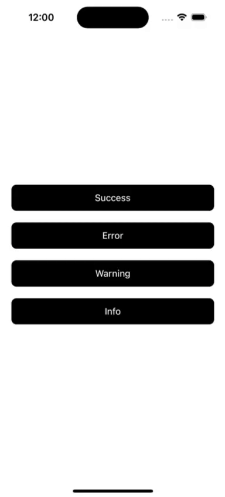

# React Native Calendar Strip Component

A lightweight, customizable, and responsive horizontal calendar strip for React Native. It supports smooth month navigation and date selection, making it ideal for apps needing calendar UI like event booking, attendance, schedules, and more.

## ✨ Features

- 📅 Horizontal scrolling calendar view
- 🔁 Month navigation (previous / next)
- 🎨 Customizable styles using `calendarStyle` prop
- 📱 Responsive with `react-native-responsive-dimensions`
- ⚡ Powered by `moment.js` for date handling

## 📸 Demo



---

## 📦 Installation

```bash
npm install react-native-calendars-strip
